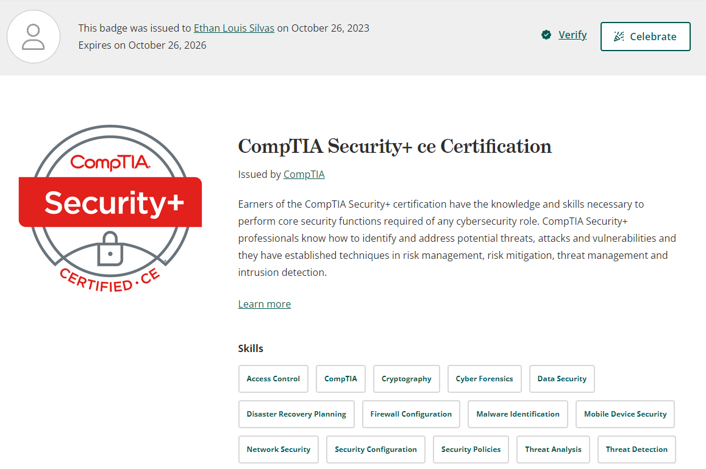

# CompTIA Security+ Certification

This repo holds all of my notes for the different resources I used to study for my [Security+](https://www.comptia.org/certifications/security) certification exam. 

You can view and verify my certification on [Credly](https://www.credly.com/badges/9f3c975d-1419-4fd0-9041-688c9c7ae0f9) or with code `TB74YM1ZKNQQ1EG4` on http://verify.CompTIA.org

Achieving this certification has prepared me to perform core security functions required of any cybersecurity role. The areas covered in this certification are: 
* Threats, attacks and vulnerabilities
* Identity and Access Management
* Technologies and Tools
* Risk Management
* Architecture and Design
* Cryptography and PKI

To prepare for this exam I used a variety of resources that are organized in this repo's directories:
* [GCGA](./GCGA/) - CompTIA Security+ Get Certified Get Ahead book by Darril Gibson
* [CertMaster](./CertMaster/) - CompTIA CertMaster Practice practice questions and exams
* [ProfessorMesser](./ProfessorMesser/) - Practice exams from Professor Messer's website
